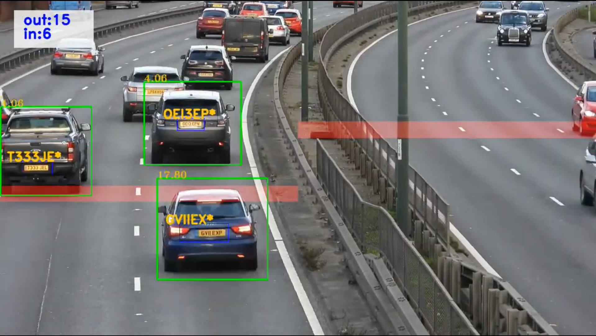

# 🚗 Vehicle Number Plate Detection & Extraction System

<p align="center">
  
</p>

---

## 📌 Project Overview

The **Vehicle Number Plate Detection & Extraction System** is a deep learning–based computer vision project that detects and tracks vehicle license plates from video input using a YOLO-based object detection model.

This system processes video frames, identifies number plates, tracks them across frames, and generates an annotated output video.

Designed for smart surveillance, traffic monitoring, and automated vehicle management systems.

---

# 🏗 System Architecture

```
          ┌────────────────────┐
          │   Input Video      │
          └─────────┬──────────┘
                    │
                    ▼
          ┌────────────────────┐
          │  Frame Extraction  │
          │   (OpenCV)         │
          └─────────┬──────────┘
                    │
                    ▼
          ┌────────────────────┐
          │ YOLO Detection     │
          │ (License Plates)   │
          └─────────┬──────────┘
                    │
                    ▼
          ┌────────────────────┐
          │ Object Tracking    │
          │ (Tracking Module)  │
          └─────────┬──────────┘
                    │
                    ▼
          ┌────────────────────┐
          │ Frame Annotation   │
          │ (Bounding Boxes)   │
          └─────────┬──────────┘
                    │
                    ▼
          ┌────────────────────┐
          │ Output Video       │
          │ (Processed Result) │
          └────────────────────┘


---

# 🔄 Workflow Pipeline


Video → Frame Processing → YOLO Detection → Tracking → Annotation → Output


---

## 🎯 Key Features

✔ YOLO-based license plate detection  
✔ Frame-by-frame video processing  
✔ Object tracking across frames  
✔ Annotated output video generation  
✔ Modular & scalable architecture  
✔ Clean production-ready structure  

---

## 🛠 Technology Stack

| Technology | Purpose |
|------------|----------|
| Python 3.x | Core programming language |
| YOLO       | License plate detection |
| OpenCV     | Video processing |
| NumPy      | Numerical computation |
| Custom Tracking Module | Object tracking |

---

## 📂 Project Structure

```
Vehicle-Number-Plate-Detection-and-Extraction/
│
├── input/                # Add your test video here
├── assets/               # Demo images
├── my_tracking/          # Tracking module
│   ├── __init__.py
│   └── tracking.py
│
├── utils/                # Utility functions
│   ├── __init__.py
│   └── video.py
│
├── main.py               # Main execution file
├── requirements.txt      # Dependencies
└── README.md


---

## ⚙️ Installation Guide

### 1️⃣ Clone Repository

bash
git clone https://github.com/adityayadav8294/Vehicle-Number-Plate-Detection-and-Extraction-
cd Vehicle-Number-Plate-Detection-and-Extraction-


### 2️⃣ Create Virtual Environment

bash
python -m venv venv


### 3️⃣ Activate Environment

**Windows**
bash
venv\Scripts\activate


**Mac/Linux**
bash
source venv/bin/activate


### 4️⃣ Install Dependencies

bash
pip install -r requirements.txt


---

## ▶️ Run the Project

Place your test video inside the `input/` folder.

bash
python main.py


The system will:

- Load the YOLO model  
- Process video frames  
- Detect license plates  
- Track detected objects  
- Generate annotated output video  

---

## 🧠 How It Works (Technical Breakdown)

1. OpenCV reads the input video frame-by-frame.
2. Each frame is passed to the YOLO model.
3. Bounding boxes are generated for detected number plates.
4. Tracking module assigns consistent IDs across frames.
5. Frames are annotated and written to output video.
6. Final processed video is saved locally.

---

## 📊 Real-World Applications

- Smart Traffic Monitoring Systems  
- Automated Toll Collection  
- Parking Management Systems  
- Law Enforcement Surveillance  
- Smart City Infrastructure  

---

## 🚀 Future Enhancements

- OCR integration for plate number extraction  
- Real-time webcam detection  
- Web-based dashboard interface  
- Cloud deployment  
- Database integration  
- REST API support  

---

## 👨‍💻 Author

**Aditya Kumar**

📧 Email: adityasingh829442@gmail.com  
🌐 Portfolio: https://aditya82.netlify.app/

---

## ⭐ Support

If you found this project useful, consider giving it a star ⭐

---

## 📜 License

This project is intended for educational and research purposes.